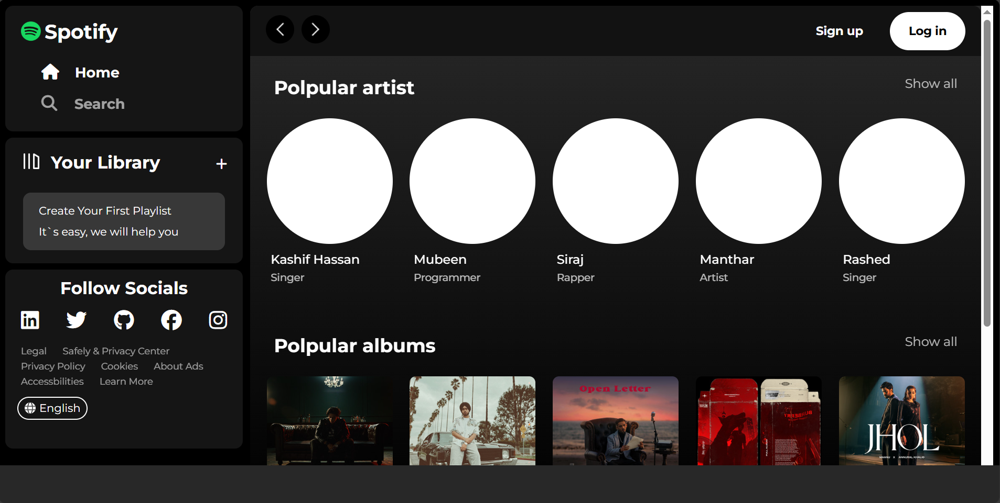

# 🎵 Spotify Clone

Welcome to **Spotify Clone** — a sleek web-based replica of Spotify, designed to showcase popular artists, albums, and radio sections with an intuitive and modern UI.

<br>

## 🚀 Demo

> 💻 **Live Preview:** [Coming Soon]

<br>



<br>

## 🌟 Features
  
✅ Popular artists & albums showcase  
✅ Interactive social media icons  
✅ Stylish UI using **HTML**, **CSS**, and **Font Awesome**  
✅ Google Fonts integration for beautiful typography

<br>

## 🛠️ Tech Stack

- **HTML5**  
- **CSS3**  
- **Font Awesome**  
- **Google Fonts**

<br>

## 📁 Project Structure
- /assets → images, icons, and logos
- index.html → main HTML structure
- style.css → custom

<br>

## 📌 How to Run

1️⃣ Clone this repository:
```bash
git clone https://github.com/Mubeen-Channa/spotify-clone.git
```

2️⃣ Open index.html in your browser.

That’s it! 🎉

<br>

## 🤝 Contributing
Feel free to fork this project, submit pull requests, or suggest new features. Let’s build something amazing together!

<br>

> ✨ Built with ❤️ by Mubeen Channa